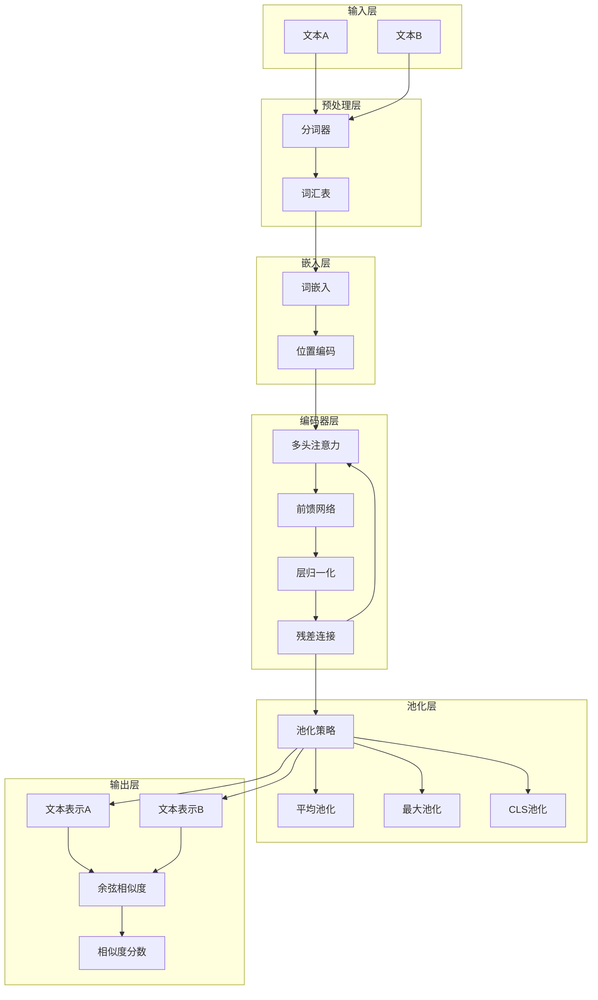
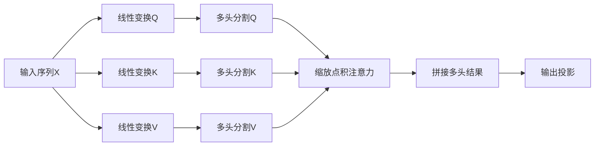
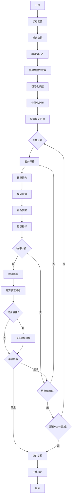
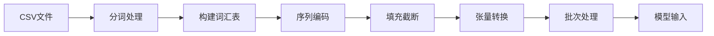
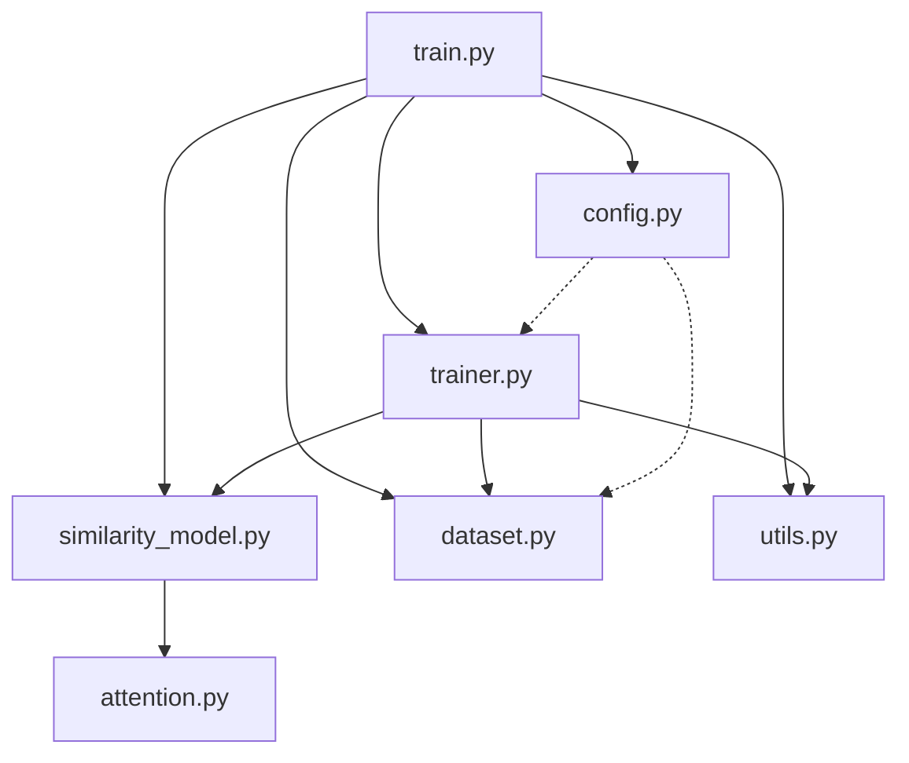
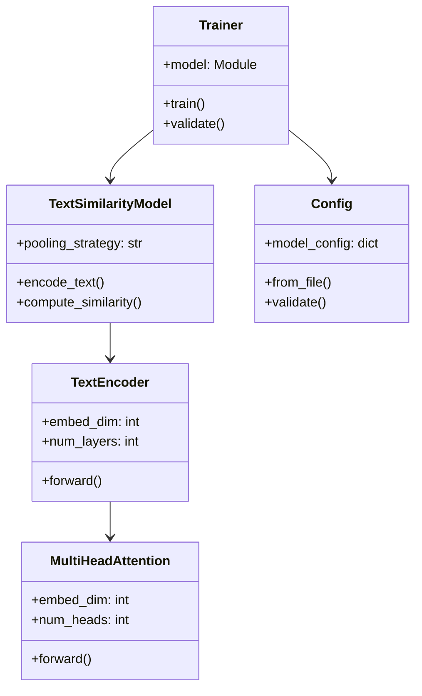
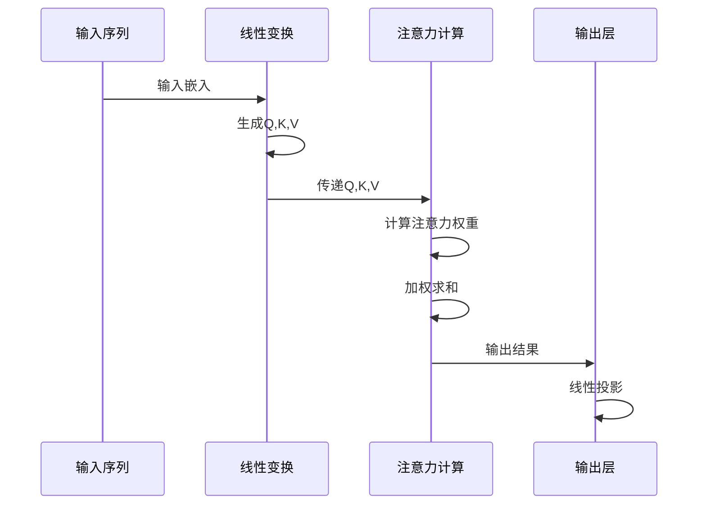

# 系统架构图

## 1. 整体架构

## 2. 多头注意力机制详解

## 3. 训练流程图

## 4. 数据流程图

## 5. 模块依赖关系

## 6. 类关系图

## 7. 注意力计算序列图

## 架构说明

### 主要组件
1. **输入层**: 处理文本A和文本B的输入
2. **预处理层**: 分词和词汇表构建
3. **嵌入层**: 词嵌入和位置编码
4. **编码器层**: 多头注意力和前馈网络
5. **池化层**: 多种池化策略选择
6. **输出层**: 计算文本相似度

### 关键特性
- 支持多种池化策略（平均、最大、CLS）
- 采用残差连接和层归一化
- 可配置的多头注意力机制
- 灵活的训练和验证流程

### 使用方式
1. 配置模型参数
2. 准备训练数据
3. 执行训练流程
4. 评估模型性能
5. 生成相似度预测
