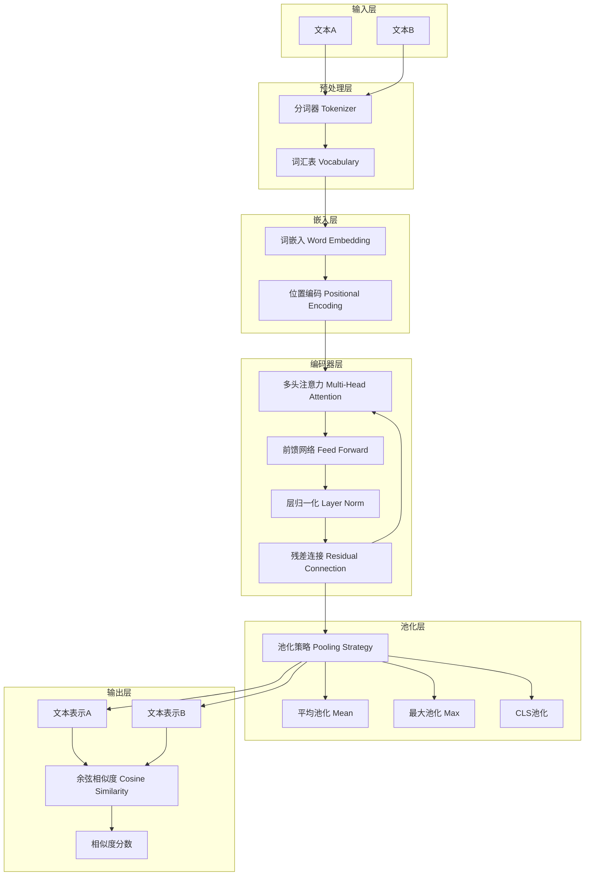
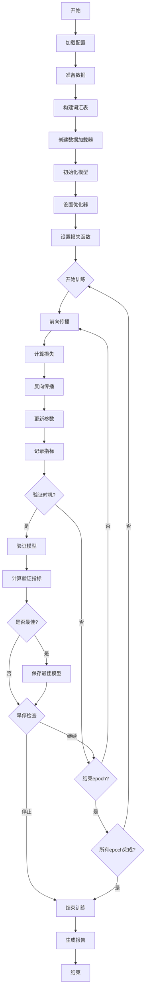
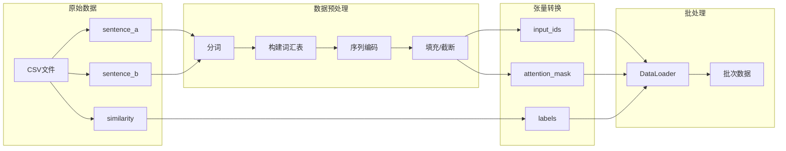
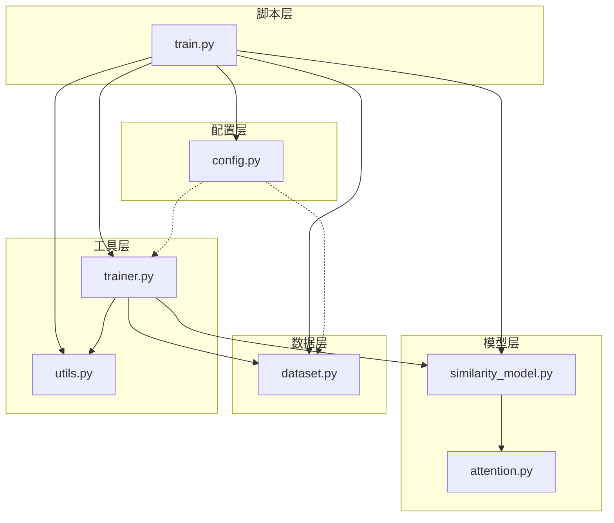
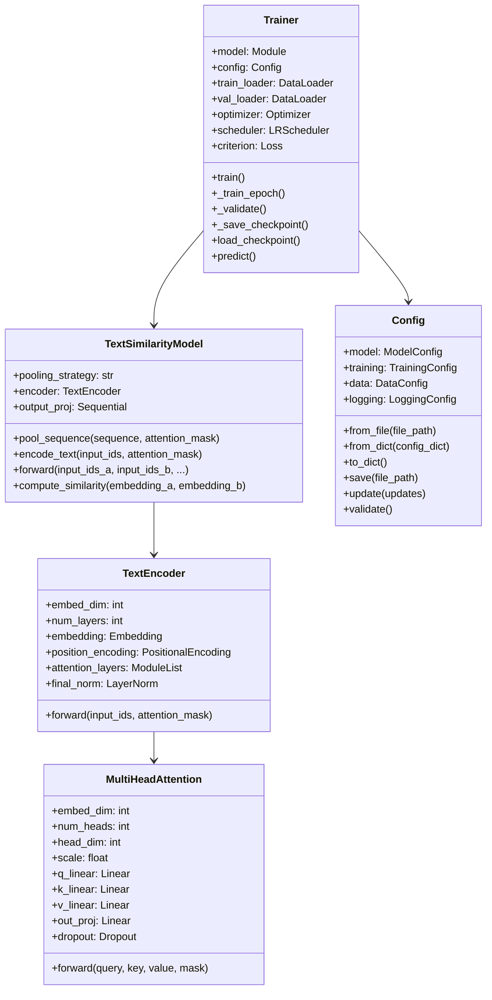
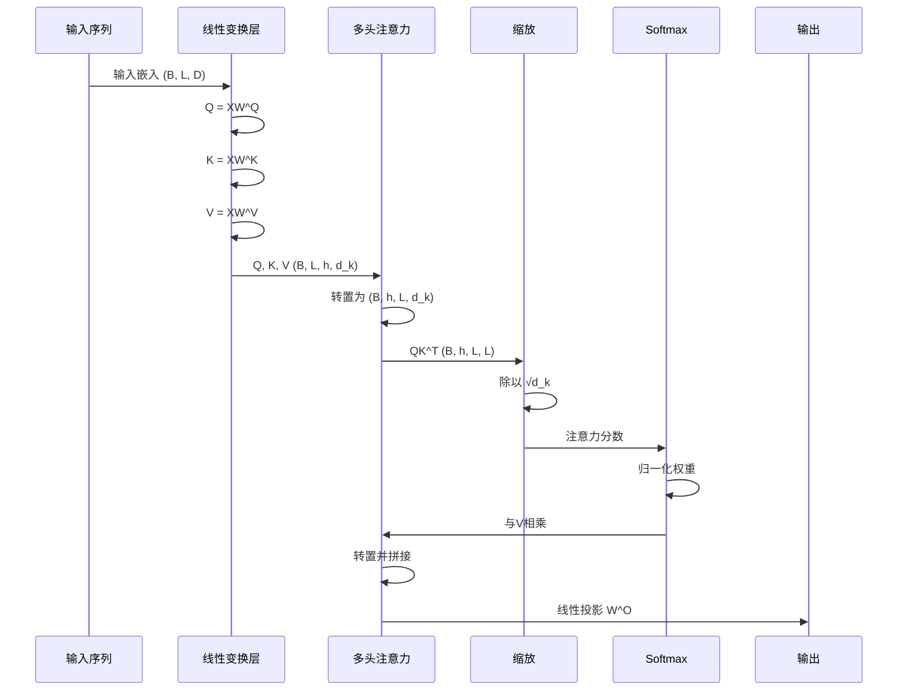

# 系统架构图

## 1. 整体架构



## 2. 多头注意力机制详解

```mermaid
graph LR
    subgraph "输入"
        A[输入序列 X]
    end
    
    subgraph "线性变换"
        B[Q = XW^Q]
        C[K = XW^K]
        D[V = XW^V]
    end
    
    subgraph "多头分割"
        E[Q_1, Q_2, ..., Q_h]
        F[K_1, K_2, ..., K_h]
        G[V_1, V_2, ..., V_h]
    end
    
    subgraph "缩放点积注意力"
        H[Attention_i = softmax(Q_iK_i^T/√d_k)V_i]
    end
    
    subgraph "拼接与投影"
        I[Concat(head_1, ..., head_h)]
        J[MultiHead = Concat·W^O]
    end
    
    A --> B
    A --> C
    A --> D
    B --> E
    C --> F
    D --> G
    E --> H
    F --> H
    G --> H
    H --> I
    I --> J
```

## 3. 训练流程图



## 4. 数据流程图



## 5. 模块依赖关系



## 6. 类图



## 7. 注意力计算流程

